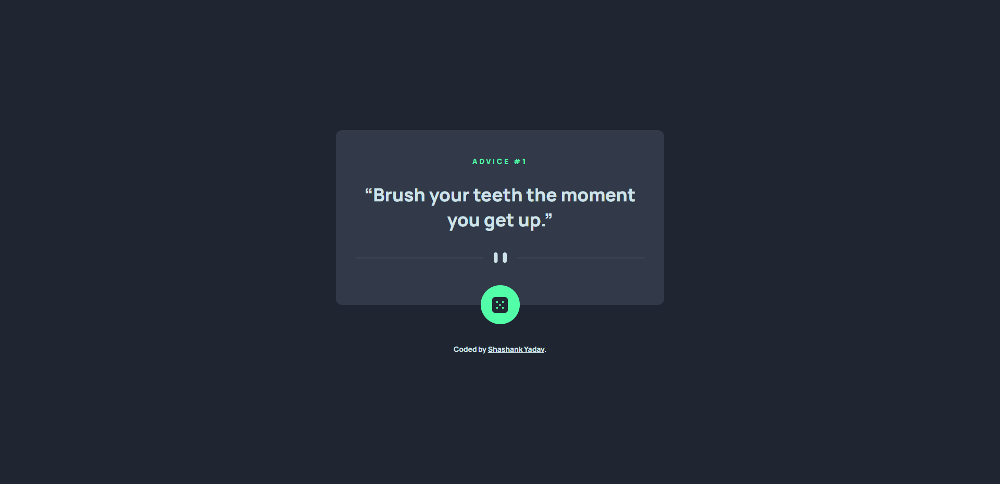
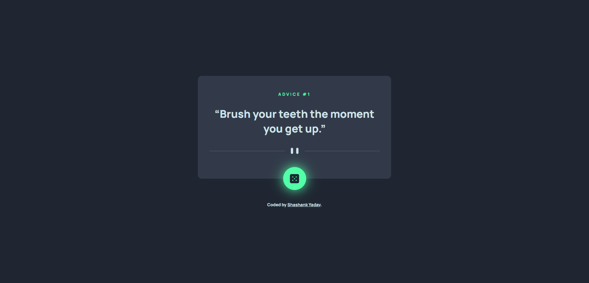
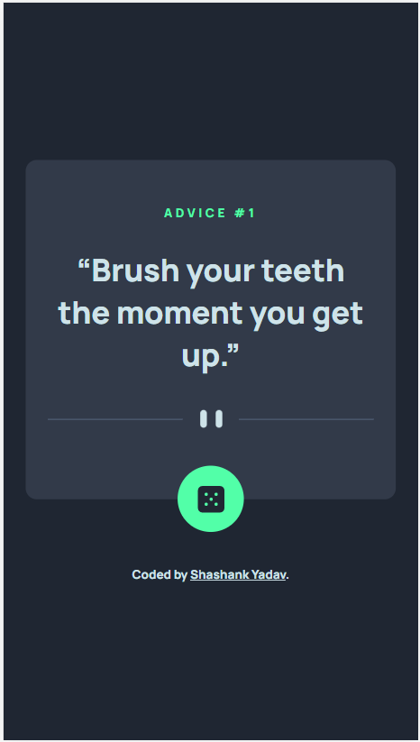

# Frontend Mentor - Advice generator app solution

This is a solution to the [Advice generator app challenge on Frontend Mentor](https://www.frontendmentor.io/challenges/advice-generator-app-QdUG-13db).

## Overview

I build out this advice generator app using the Advice Slip API.

Users will be able to:

- View the optimal layout for the app depending on their device's screen size
- See hover states for all interactive elements on the page
- Generate a new piece of advice by clicking the dice icon
- For non-touch devices it will show glow on dice when hover, but for touch devices dice will keep blinking after first click

### Screenshot

### Links

- Solution URL: [Solution URL](https://github.com/yshashanky/advice-generator-app-main)
- Live Site URL: [Live site URL](https://advice-generator-app-yshashanky.netlify.app)

### Built with

- Semantic HTML5 markup
- CSS custom properties
- Flexbox
- JavaScript
- [Advice Slip API](https://api.adviceslip.com)
- [Font](https://fonts.google.com/specimen/Manrope)

### What I learned

From this project I have learned how to fetch response from API and display it as required.

## Author

- Frontend Mentor - [@yshashanky](https://www.frontendmentor.io/profile/yshashanky)
- Github - [@yshashanky](https://github.com/yshashanky)

**Have fun building!** 🚀
